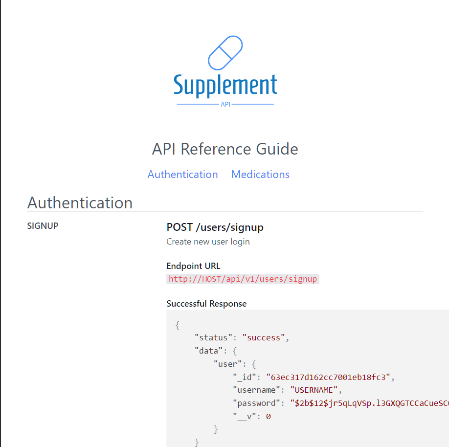

<!-- PROJECT LOGO -->

  <h1 align="center">Supplement API</h1>

  
 
    <a href="https://github.com/feliceforgione/supplementAPI/issues">Report Bug</a>
    ·
    <a href="https://github.com/feliceforgione/supplementAPI/issues">Request Feature</a>
  

<!-- ABOUT THE PROJECT -->
 

## About The Project

|                                                                          |                                                                                   |
| ------------------------------------------------------------------------ | --------------------------------------------------------------------------------- |
|  |  |
|                                                                          |                                                                                   |

API to provide information about supplements and herbs.

 

### Built With

|                                         |                                      |
| --------------------------------------- | ------------------------------------ |
| [Node.js](https://nodejs.org/en/)       | [Express.js](https://expressjs.com/) |
| [MongoDB](https://www.mongodb.com/)     | [Redis](https://redis.io/)           |
| [NGINX](https://www.nginx.com/)         | [Docker](https://www.docker.com/)    |
| [Tailwindcss](https://tailwindcss.com/) |                                      |

 

<!-- Setup -->

## Setup

- Setup `.env` file based off `.env=sample`
- Start docker container `docker-compose -f docker-compose.yml -f docker-compose.dev.yml up -d --build`
  - Node server is contained and started within docker container. No need to start nodeserver manually.

<!-- Usage -->

## Usage

Server can be accessed at: `http://localhost:3000/`

<!-- ROADMAP -->

## Roadmap

- [ ] Add React Frontend
- [ ] Add more supplement entries into database

 

See the [open issues](https://github.com/feliceforgione/supplementAPI/issues) for a full list of proposed features (and known issues).

 

<!-- CONTRIBUTING -->

## Contributing

Contributions are what make the open source community such an amazing place to learn, inspire, and create. Any contributions you make are **greatly appreciated**.

If you have a suggestion that would make this better, please fork the repo and create a pull request. You can also simply open an issue with the tag "enhancement".
Don't forget to give the project a star! Thanks again!

1. Fork the Project
2. Create your Feature Branch (`git checkout -b feature/AmazingFeature`)
3. Commit your Changes (`git commit -m 'Add some AmazingFeature'`)
4. Push to the Branch (`git push origin feature/AmazingFeature`)
5. Open a Pull Request

 
<!-- CONTACT -->

## Contact

Felice Forgione - [@forgione67](https://twitter.com/forgione67)

Project Link: [https://github.com/feliceforgione/supplementAPI](https://github.com/feliceforgione/supplementAPI)
